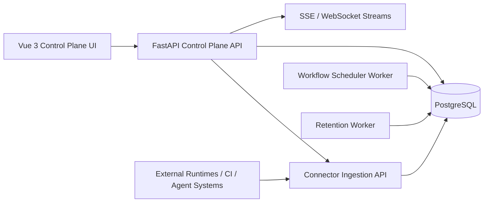
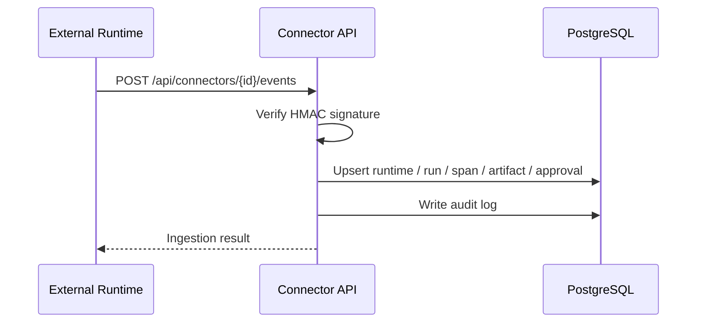
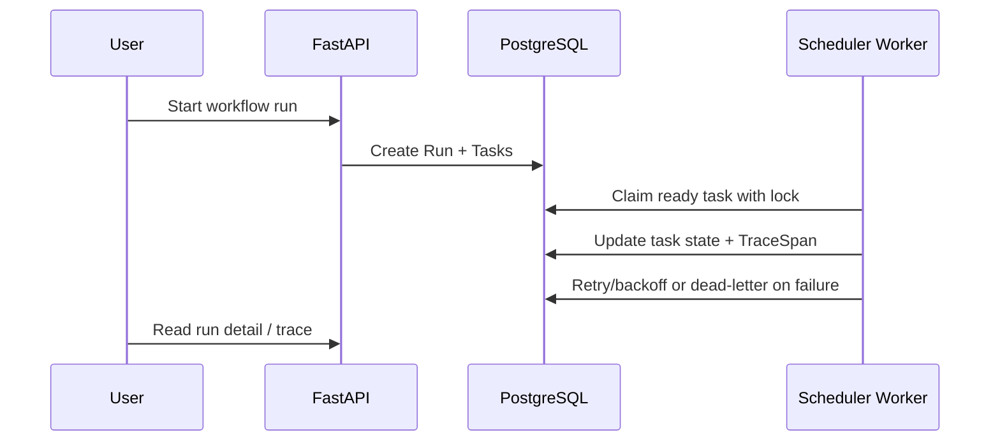

# Architecture — AI Workflow Control Plane

## Status

This document describes the current v3 release-ready architecture. Historical Hermès Bridge and code-review-specific architecture documents are archived under `docs/archive/`.

## System Overview



## Core Responsibilities

| Layer | Responsibility |
|---|---|
| Frontend | Workflow observability, approvals, RCA/runbook, eval/config, workflows, enterprise admin |
| FastAPI API | REST APIs, connector ingestion, RBAC, webhook verification, audit logging |
| PostgreSQL | Primary storage for runs, traces, workflows, approvals, artifacts, evals, users, teams, environments |
| Scheduler Worker | Durable workflow execution, task claiming, retry/backoff, timeout, dead-letter |
| Retention Worker | Policy-based cleanup with dry-run and audit logging |
| Connectors | Runtime-agnostic event ingestion from external systems |

## Primary Domain Model

The platform is runtime-agnostic. The current core objects are:

- Runtime
- Run
- Task
- TraceSpan
- ToolCall
- Approval
- Artifact
- EvalResult
- WorkflowDefinition
- WorkflowNode
- WorkflowEdge
- ConnectorConfig
- User / Team / Environment
- AuditLog

## API Boundaries

### Current Control Plane APIs

- `/api/runs`
- `/api/runtimes`
- `/api/workflows`
- `/api/connectors`
- `/api/approvals`
- `/api/tools`
- `/api/evals`
- `/api/config-versions`
- `/api/users`
- `/api/teams`
- `/api/environments`

### Legacy / Compatibility APIs

The app still contains compatibility endpoints for older dashboard, session, agent chat, terminal, provider, cost, and code-review flows. They must not be treated as the product center.

Next optimization work should move them behind explicit legacy routers and add deprecation headers where appropriate.

## Data Flow

### Connector Ingestion



### Workflow Execution



## Security Architecture

| Concern | Current Implementation | Next Optimization |
|---|---|---|
| Secret storage | Fernet encryption, masked responses | rotation workflow and secret audit UI |
| Webhook verification | HMAC-SHA256 over raw body with timestamp tolerance | connector-specific signing docs and SDK helpers |
| RBAC | role helper with admin/operator/viewer, header placeholder | real auth MVP and service tokens |
| Audit | centralized audit writer for mutations | searchable Audit UI |
| Production safety | production requires `ENCRYPTION_KEY` | deployment health gates |

## Runtime Topology

Recommended production topology:

```text
web: FastAPI + Vue static serving/reverse proxy
scheduler-worker: workflow execution worker
retention-worker: lifecycle cleanup worker
postgres: primary database
reverse-proxy: optional TLS and routing layer
```

## Current Architecture Risks

- `backend/main.py` still contains legacy endpoints and should be split.
- `frontend/src/App.vue` still mixes routing, data loading, and page rendering.
- RBAC is not backed by real authentication yet.
- Some old UI pages and docs still carry legacy product language.
- SQLite fallback remains as compatibility and should be made read-only, then removed.

## Next Architecture Direction

See `docs/PLATFORM_OPTIMIZATION_EXECUTION_PLAN.md`.

